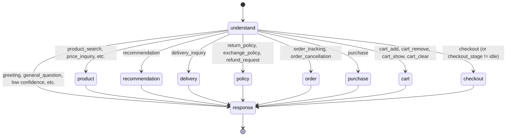

# Fashion Hub AI Assistant — Architecture Document

This document describes the complete AI architecture powering the Fashion Hub AI Assistant, from LangGraph workflow orchestration through to inventory transaction management.

---

## 1. LangGraph Workflow

The system uses LangGraph's `StateGraph` to model a multi-stage conversational pipeline. Each node is an async function that reads from and mutates a shared `GraphState`.

### GraphState

```python
class GraphState(TypedDict):
    session_id: str
    customer_id: Optional[str]
    platform: Optional[str]
    message: str

    customer: Optional[Dict[str, Any]]
    conversation: Optional[Dict[str, Any]]
    history: Optional[List[Dict[str, Any]]]

    intent: Dict[str, Any]
    sentiment: Dict[str, Any]
    entities: Dict[str, Any]
    customer_goal: str

    products: Optional[List[Dict[str, Any]]]
    recommendations: Optional[List[Dict[str, Any]]]
    order: Optional[Dict[str, Any]]
    delivery: Optional[Dict[str, Any]]
    policies: Optional[Dict[str, Any]]
    settings: Optional[Dict[str, Any]]

    cart: Optional[List[Dict[str, Any]]]
    checkout_stage: Optional[str]
    purchase_confirmed: Optional[bool]
    purchase_result: Optional[Dict[str, Any]]

    temp_product: Optional[Dict[str, Any]]
    temp_quantity: Optional[int]
    temp_address: Optional[str]
    temp_city: Optional[str]
    temp_payment: Optional[str]

    reply: str
```

### Nodes (10 total)

| Node | Function | Responsibility |
|---|---|---|
| `understand` | `understand_node` | Calls the LLM to classify intent, sentiment, entities, and customer goal. Entry point of the graph. |
| `product` | `product_node` | Searches products via `ProductTool.search_products()` using extracted entities. |
| `recommendation` | `recommendation_node` | Generates personalized recommendations via `RecommendationTool.recommend_products()`. |
| `cart` | `cart_node` | Handles cart add/remove/show/clear via `CartTool`. |
| `checkout` | `checkout_node` | Multi-stage checkout flow — address, city, payment, confirmation. |
| `purchase` | `purchase_node` | Searches product for intent to buy; initiates checkout if single match. |
| `order` | `order_node` | Looks up orders by ID, tracking number, or customer. Handles cancellation. |
| `delivery` | `delivery_node` | Fetches delivery charges / settings via `SettingTool`. |
| `policy` | `policy_node` | Fetches store policies via `SettingTool`. |
| `response` | `response_node` | Generates final natural-language reply. Finish point of the graph. |

### Routing

The graph entry point is `understand`. From there, `route_intent()` performs conditional routing:

```
understand ──route_intent()──→ product
                              → recommendation
                              → delivery
                              → policy
                              → order
                              → purchase
                              → cart
                              → checkout
                              → response (direct)
```

Key routing rules:

- **Confidence threshold**: 0.3. If `confidence < 0.3` and the intent is not a simple greeting/goodbye/etc., routing falls through to `response` without executing a domain node.
- **Checkout override**: If `checkout_stage != "idle"`, all traffic is routed to `checkout` regardless of detected intent. This prevents the LLM from re-classifying mid-checkout messages like "Lahore" or "Cash on Delivery".
- All domain nodes (`product`, `recommendation`, `delivery`, `policy`, `order`, `purchase`, `cart`, `checkout`) have a direct edge to `response`.
- `response` is the finish point.

### Mermaid Diagram



---

## 2. Prompt Flow Architecture

The prompt system is layered: a universal understanding prompt, a shared system core, and 11 intent-specific response prompts.

### UNDERSTAND_PROMPT

Located in `app/llm/prompts.py`. This prompt:

- Instructs the LLM to **only** understand, never answer.
- Requires **strict JSON output** with a fixed schema.
- Lists 26 available intents, 5 sentiments, and 22 entity fields.
- Includes 14+ examples showing correct intent + entity extraction.
- Covers edge cases: short messages during checkout, brand → `productName` mapping, price range parsing (`maxPrice`/`minPrice`/`budget`).

### SYSTEM_CORE

Located in `app/llm/prompts.py` (line 128–146). This is the base prompt appended to every response prompt. It defines 14 critical rules:

1. Never invent products, prices, discounts, or stock.
2. Never guess database contents.
3. Use only provided data sections.
4. If "No matching products found", do not describe any product.
5. If empty results, suggest different keywords/filters.
6. Distinguish general fashion knowledge from store data.
7. Explain recommendation rationale using retrieved data.
8. Ask for Order ID if missing for order queries.
9. Extra empathy for frustrated/angry sentiment.
10. Never mention AI, databases, or internal systems.
11. Keep replies natural and professional.
12. Max 3 products per response.
13. Admit unavailable data and offer alternatives from provided data.
14. Read MATCHING PRODUCTS section and respond accordingly.

### Intent-Specific Prompts (11)

| Prompt | Used For |
|---|---|
| `GENERAL_RESPONSE_PROMPT` | greeting, goodbye, general_question, human_support, other |
| `PRODUCT_RESPONSE_PROMPT` | product_search, product_details, price_inquiry, discount_inquiry, size_inquiry, color_inquiry, stock_inquiry, availability |
| `RECOMMENDATION_RESPONSE_PROMPT` | recommendation |
| `DELIVERY_RESPONSE_PROMPT` | delivery_inquiry |
| `POLICY_RESPONSE_PROMPT` | return_policy, exchange_policy, refund_request |
| `ORDER_RESPONSE_PROMPT` | order_tracking, order_placement, order_cancellation |
| `COMPLAINT_RESPONSE_PROMPT` | complaint |
| `COMPARISON_RESPONSE_PROMPT` | compare_products |
| `PURCHASE_RESPONSE_PROMPT` | purchase |
| `CART_RESPONSE_PROMPT` | cart_add, cart_remove, cart_show, cart_clear |
| `CHECKOUT_RESPONSE_PROMPT` | checkout |

Each extends `SYSTEM_CORE` with domain-specific instructions. Selection logic is in `response.py:generate_response()` (lines 67–149). The builder then injects live data sections (MATCHING PRODUCTS, RECOMMENDATIONS, DELIVERY INFORMATION, ORDER INFORMATION, STORE POLICIES, CART INFORMATION, CHECKOUT STAGE, CHAT HISTORY, CUSTOMER PROFILE, EXTRACTED ENTITIES) before calling the LLM.

---

## 3. Intent Detection

The system supports 26 intents across 8 categories. Detection is handled in `app/llm/understand.py`.

### Primary Detection (LLM-based)

`understand_customer()` sends the `UNDERSTAND_PROMPT` + user message to the LLM. The LLM returns a JSON object which is validated by `validate_response()` against the allowed intent set and normalized entities.

### Fallback Detection (Keyword-based)

If the LLM call fails (e.g., rate limit, malformed JSON, network error), `_fallback_classify()` performs keyword matching against predefined dictionaries with a fixed confidence of 0.4.

### Intent Categories

```
Greetings:
  greeting, goodbye

Products:
  product_search, product_details, price_inquiry, discount_inquiry,
  size_inquiry, color_inquiry, stock_inquiry, availability,
  compare_products

Recommendations:
  recommendation

Orders:
  order_tracking, order_cancellation

Cart:
  cart_add, cart_remove, cart_show, cart_clear

Purchase:
  purchase

Checkout:
  checkout

Policies:
  return_policy, exchange_policy, refund_request

Delivery:
  delivery_inquiry

Other:
  complaint, human_support, general_question, other
```

Intent guidance in the prompt distinguishes closely related intents:
- `purchase` vs `cart_add`: "buy this"/"I'll take this" → purchase; "add to cart" → cart_add.
- `checkout` vs `purchase`: "checkout"/"place order" → checkout; triggers the multi-stage flow.

---

## 4. Entity Extraction

### Entity Schema (22 fields)

```json
{
  "category": "", "subCategory": "", "productName": "", "gender": "",
  "color": "", "size": "", "season": "", "budget": "",
  "minPrice": "", "maxPrice": "", "trend": "", "bestSeller": "",
  "city": "", "province": "", "order_id": "", "tracking_number": "",
  "quantity": "", "discount": "", "rating": "", "sort_by": "",
  "sort_order": ""
}
```

### Extraction Rules

Defined in the `UNDERSTAND_PROMPT`:
- **Category/subcategory**: Hierarchical — `category` for top-level, `subCategory` for nested.
- **Gender**: Normalized via `GENDER_MAP` in `filter_builder.py` (`Men`/`Women`/`Boys`/`Girls`/`Kids`/`Unisex`).
- **Price ranges**: `under X` → `maxPrice`; `above X` → `minPrice`; `around X` / `budget X` → `budget`.
- **Trend/Bestseller**: String `"true"` → boolean filter.
- **Brand → productName**: If user mentions a brand (Nike, Adidas, etc.), it is extracted into `productName`.
- **Order fields**: `order_id` for tracking, `tracking_number` for courier lookup.
- **Sort options**: `sort_by` (price/rating) + `sort_order` (asc/desc).
- **Quantity**: Parsed from number words ("two" → 2) or digits.

### filter_builder.py

`build_product_filter(entities: dict)` converts extracted entities into a MongoDB query document:

- `productName` → `$regex` with plural-aware pattern matching (`_plural_aware_pattern` handles "dresses" → `dress|dresses`).
- `category` / `subCategory` → `$regex`.
- `gender` → normalized and regex-anchored.
- `color` → matched against the `colors` array field.
- `size` → matched against the `sizes` array field.
- `minPrice`/`maxPrice`/`budget` → `price` range filter (`$gte`/`$lte`).
- `bestSeller` → `isBestSeller: true`.
- `trend` → `isTrending: true`.
- `discount` → parsed numeric threshold or boolean (`$gt: 0`).
- `rating` → `$gte` filter.
- `stock: {$gt: 0}` is always appended.
- `build_sort_config()` maps `sort_by`/`sort_order` to MongoDB sort tuples.

---

## 5. Tool Routing

Each graph node delegates to a tool class, which wraps a service layer. The wiring is done at startup in `main.py`.

| Graph Node | Tool | Service(s) |
|---|---|---|
| `product_node` | `ProductTool` | `ProductService` |
| `recommendation_node` | `RecommendationTool` | `RecommendationService` |
| `cart_node` | `CartTool` | `CartService` |
| `checkout_node` | `CheckoutTool` + `CartTool` + `PurchaseTool` | `CheckoutService` + `CartService` + `OrderService` + `InventoryHistoryService` |
| `purchase_node` | `ProductTool` + `CheckoutTool` | `ProductService` + `CheckoutService` |
| `order_node` | `OrderTool` + `PurchaseTool` | `OrderService` + `InventoryHistoryService` |
| `delivery_node` | `SettingTool` | `SettingService` |
| `policy_node` | `SettingTool` | `SettingService` |
| `response_node` | (None — LLM call directly) | (None) |
| `understand_node` | (None — LLM call directly) | (None) |

Tool construction in `main.py`:

```python
product_tool = ProductTool()
setting_tool = SettingTool()
order_tool = OrderTool()
conversation_tool = ConversationTool()
customer_channel_tool = CustomerChannelTool()
recommendation_tool = RecommendationTool(RecommendationService(product_tool))
cart_tool = CartTool()
checkout_tool = CheckoutTool()
purchase_tool = PurchaseTool()
```

---

## 6. Services Architecture

The service layer sits between tools and repositories, encapsulating business logic.

| Service | Lines | Key Responsibilities |
|---|---|---|
| `OrderService` | 515 | Transactional order creation (validate → calculate → decrement → record), cancellation with stock restore, order lookup. |
| `CartService` | 117 | Stock validation before add, upsert cart, calculate totals (subtotal, discount). |
| `CheckoutService` | 72 | Parse address/city/payment from free text, affirmative/negative detection, stage progression. |
| `ProductService` | 41 | Search with filter building, CRUD delegation to repository. |
| `RecommendationService` | 63 | Priority-based personalization: explicit params → customer preferences → fallback. |
| `SettingService` | — | Delivery charges, policies, store info, contact info. |
| `InventoryHistoryService` | 35 | Audit trail — records purchase and cancellation deltas. |
| `ConversationService` | — | Conversation CRUD (customer messages, agent responses). |
| `CustomerService` | — | Customer lookup and preferences. |
| `CustomerChannelService` | — | Channel/platform association. |

### OrderService — Transactional Order Creation (`create_order`)

Uses MongoDB transactions (`start_session()` → `start_transaction()`):

1. **Validate** each product exists and has sufficient stock.
2. **Calculate pricing**: `final_price = price - (price * discount / 100)`. Accumulates subtotal and total_discount.
3. **Calculate delivery**: Looks up city/province charge, applies free delivery threshold.
4. **Decrement stock**: Calls `product_repository.update_stock(product_id, quantity)` with `$inc: {stock: -quantity}`.
5. **Create order record**: Generates `ORD-XXXXXXXX` order ID, stores with customer, items, pricing, payment info.
6. **Record customer history**: Adds order reference to customer's order history.
7. Rolls back on any exception via `session.abort_transaction()`.

### CartService — Stock Validation

Before adding items, `CartService.add_item()`:
- Checks `product["stock"] < quantity` → raises `ValueError`.
- For merged quantities (same product/color/size): checks cumulative quantity against stock.
- Calculates discount amounts and subtotals for each item.

### RecommendationService — Personalization

Three-tier fallback:
1. **Explicit filters** (gender, category, color, season, trend, budget, best-seller).
2. **Customer preferences** (favoriteCategory, favoriteColor from customer profile).
3. **Default**: Returns latest 5 products.

### CheckoutService — Multi-Stage Parsing

Stage progression: `idle → ask_address → ask_city → ask_payment → confirm → complete`.

```python
NEXT_STAGES = {
    "idle": "ask_address",
    "ask_address": "ask_city",
    "ask_city": "ask_payment",
    "ask_payment": "confirm",
    "confirm": "complete",
    "complete": "idle",
}
```

- `parse_address`: validates minimum length (3 chars).
- `parse_city`: validates minimum length (2 chars).
- `parse_payment`: maps aliases → canonical names (COD → "Cash on Delivery", etc.).
- `is_affirmative` / `is_negative`: keyword matching for confirmation/cancellation.

### InventoryHistoryService — Audit Trail

Records every stock mutation with before/after snapshots:

```python
# Purchase entry
{
    "orderId": "ORD-ABCD1234",
    "productId": "...", "productName": "...",
    "changeType": "purchase",
    "quantityBefore": 50, "quantityAfter": 48,
    "delta": -2,
    "createdAt": "..."
}

# Cancellation entry
{
    "changeType": "cancellation",
    "quantityBefore": 48, "quantityAfter": 50,
    "delta": 2,
    ...
}
```

Stored in the `inventory_history` MongoDB collection.

---

## 7. Conversation History

### Flow

1. The **frontend** sends a `history` array with each `POST /chat` request.
2. `ChatRequest.history: Optional[List[Dict[str, Any]]]` defaults to `[]`.
3. History is stored in `GraphState.history` via `Workflow.run()`.
4. In `response_node`, the last 5 entries (`history[-5:]`) are serialized into the prompt under the **CHAT HISTORY** section.
5. History is **not** passed to the `understand` call — only the current `message` is analyzed. This prevents historical context from contaminating intent classification.

### Purpose

- Provides conversational continuity for the response LLM.
- Enables context-aware replies (e.g., "As I mentioned earlier...").
- Shows the LLM both the customer's previous messages and the assistant's previous replies.

---

## 8. Transaction Flow

### Purchase Transaction

```
Customer: "I want to buy a red shirt"
    │
    ▼
understand_node ──intent: "purchase"──→ purchase_node
    │                                        │
    │                                   Searches product
    │                                   Single match? → temp_product, stage=ask_address
    │                                   Multiple? → stage=idle (LLM clarifies)
    ▼                                        │
checkout_node ←── (subsequent messages) ─────┘
    │
    ├── stage=ask_address  →  parse_address  →  stage=ask_city
    ├── stage=ask_city     →  parse_city      →  stage=ask_payment
    ├── stage=ask_payment  →  parse_payment   →  stage=confirm
    ├── stage=confirm      →  is_affirmative? →  execute_purchase()
    │                                              │
    │                            ┌─────────────────┘
    │                            ▼
    │                    OrderService.create_order()
    │                      ├── Validate stock
    │                      ├── Calculate pricing
    │                      ├── Calculate delivery charge
    │                      ├── $inc stock (decrement)
    │                      ├── Create order document
    │                      ├── Add to customer history
    │                      └── Commit transaction
    │                            │
    │                    InventoryHistoryService.record_purchase()
    │                      ├── snapshot before/after stock
    │                      └── delta = -quantity_purchased
    │                            │
    │                    Cart cleared
    │                            │
    └── stage=complete → response_node (shows order summary)
```

### Cancellation Transaction

```
Customer: "Cancel order ORD-ABCD1234"
    │
    ▼
understand_node ──intent: "order_cancellation"──→ order_node
    │                                                  │
    │                                            order_tool.get_order_by_number()
    │                                            Order exists & not cancelled?
    │                                                  │
    │                                            purchase_tool.cancel_order_with_restore()
    │                                              ├── For each product in order:
    │                                              │     ├── product_repository.increase_stock()
    │                                              │     │     └── $inc stock (increment)
    │                                              │     └── inventory_history.record_cancellation()
    │                                              │           ├── snapshot before/after
    │                                              │           └── delta = +quantity_restored
    │                                              └── order_repository.update_status("Cancelled")
    │                                                    │
    ▼                                                    ▼
response_node ──→ "Your order ORD-ABCD1234 has been cancelled."
```

### Key Design Properties

- **Atomic stock operations**: `$inc` is atomic in MongoDB — no race conditions on concurrent decrements.
- **Transactional integrity**: MongoDB sessions with `abort_transaction()` on failure ensure orders and stock are always consistent.
- **Audit trail**: Every stock change is recorded with before/after values in `inventory_history`.
- **Idempotent cancellation**: Orders already in "Cancelled" status raise `ValueError` — prevents double-restore.
