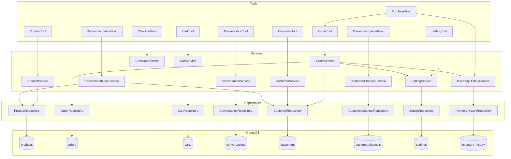

# Backend Documentation — Fashion Hub AI Assistant

## 1. FastAPI Application (`ai-service/app/main.py` — 101 lines)

The AI service is a **FastAPI** application running on Python 3.11+ using an async lifespan context manager.

### Lifespan Context Manager

```python
@asynccontextmanager
async def lifespan(app: FastAPI):
    await connect_database()
    # Tool creation...
    app.state.workflow = Workflow(nodes)
    yield
    await close_database()
```

- **Startup**: calls `connect_database()` (Motor connection + index creation), instantiates all tools, wraps them in `GraphNodes`, and stores a `Workflow` instance in `app.state.workflow`.
- **Shutdown**: calls `close_database()` which closes the Motor client.

### Dependency Injection Pattern

Tools are created inside `lifespan` and passed to `GraphNodes`. The `Workflow` object is stored in `app.state`, avoiding global state. There are **no FastAPI `Depends()` calls** — the graph-based architecture uses LangGraph internally.

### CORS Configuration

```python
app.add_middleware(
    CORSMiddleware,
    allow_origins=["*"],
    allow_credentials=True,
    allow_methods=["*"],
    allow_headers=["*"],
)
```

Wide-open CORS for development; restrict origins in production.

### Endpoints

| Method | Path | Description |
|--------|------|-------------|
| `GET /` | Health check | Returns `{"status": "running", "service": "FashionHub AI"}` |
| `POST /chat` | Chat message | Accepts `ChatRequest`, runs workflow, returns reply/intent/sentiment/entities |

**`POST /chat`** request body:
```json
{
  "session_id": "str",
  "message": "str",
  "customer_id": "str | null",
  "platform": "str | null",
  "history": "List[Dict[str, Any]] | []"
}
```

Response:
```json
{
  "reply": "str",
  "intent": {},
  "sentiment": {},
  "entities": {}
}
```

---

## 2. Configuration (`ai-service/app/config.py` — 66 lines)

Loads environment from `ai-service/.env` using `python-dotenv`.

```python
class Settings:
    MONGO_URI         # MongoDB connection string
    DATABASE_NAME     # Database name (fashionhub)
    GEMINI_API_KEY    # Google Gemini API key
    MODEL_NAME        # Gemini model name (e.g., gemini-2.0-flash)
    HOST              # Server host (default: 127.0.0.1)
    PORT              # Server port (default: 8000)
    DEBUG             # Boolean debug flag

settings = Settings()   # Singleton instance
```

---

## 3. Database (`ai-service/app/database.py` — 77 lines)

Singleton pattern via a module-level `Database` object:

```python
class Database:
    client: AsyncIOMotorClient = None
    db = None

database = Database()
```

### Connection

```python
async def connect_database():
    database.client = AsyncIOMotorClient(
        settings.MONGO_URI,
        maxPoolSize=10,
        minPoolSize=1,
        serverSelectionTimeoutMS=5000,
        connectTimeoutMS=5000,
    )
    database.db = database.client[settings.DATABASE_NAME]
    await _ensure_indexes()
```

### Index Management (`_ensure_indexes`)

Creates **23 indexes** across 6 collections:

| Collection | Indexes |
|-----------|---------|
| `products` | `productName`, `category`, `gender`, `price`, compound text `(productName, category, description)`, `isBestSeller`, `isTrending`, `season`, `colors` |
| `orders` | `orderId` (unique), `customer`, `status` |
| `conversations` | `customer`, `platform`, `updatedAt` |
| `customers` | `whatsappNumber`, `instagramId` |
| `carts` | `customer_id`, `session_id`, `updatedAt` |
| `inventory_history` | `orderId`, `productId`, `createdAt` |

### Named Collections

| Name | Usage |
|------|-------|
| `products` | Product catalog |
| `orders` | Customer orders |
| `conversations` | Chat history |
| `customers` | Customer profiles |
| `carts` | Shopping carts |
| `inventory_history` | Stock change audit log |

---

## 4. Models (`ai-service/app/models/`)

### `request.py` — ChatRequest

```python
class ChatRequest(BaseModel):
    session_id: str
    message: str
    customer_id: Optional[str] = None
    platform: Optional[str] = None
    history: Optional[List[Dict[str, Any]]] = []
```

### `schemas.py` — ProductCreate / ProductUpdate

```python
class ProductCreate(BaseModel):
    productName: str
    category: str
    price: float
    description: Optional[str]
    sizes: List[str] = []
    colors: List[str] = []
    stock: int = 0
    images: List[str] = []
    discount: float = 0
    rating: float = 0
    gender: Optional[str] = None

class ProductUpdate(BaseModel):
    # All fields Optional for partial updates
    productName, category, price, description,
    sizes, colors, stock, images, discount, rating, gender
```

### `customer.py` — Document Factory

```python
def customer_model(name="", phone_number="", whatsapp_number="", ...):
    return {
        "name", "phoneNumber", "whatsappNumber", "instagramId",
        "email", "address", "city",
        "preferences": {"favoriteCategory", "favoriteColor", "favoriteSize", "budget", "gender"},
        "orderHistory": [],
        "createdAt", "updatedAt"
    }
```

### `customer_channel.py` — Document Factory

```python
def customer_channel_model(customer_id, platform, platform_user_id):
    return {
        "customerId", "platform", "platformUserId",
        "createdAt", "updatedAt"
    }
```

---

## 5. Services Layer

### Complete List of 10 Services

| Service | File | Lines | Purpose |
|---------|------|-------|---------|
| **OrderService** | `order_service.py` | 515 | Order CRUD, purchase flow, cancellation with stock restore |
| **CartService** | `cart_service.py` | 117 | Cart item add/remove/update/clear |
| **ProductService** | `product_service.py` | 41 | Product search, CRUD, filter building |
| **CustomerService** | `customer_service.py` | 146 | Customer CRUD, lookup by WhatsApp/Instagram |
| **CustomerChannelService** | `customer_channel_service.py` | 75 | Get-or-create platform channel mapping |
| **ConversationService** | `conversation_service.py` | 241 | Conversation CRUD, message append, analysis update |
| **SettingService** | `setting_service.py` | 230 | Store settings, delivery calc, policies, contact info |
| **CheckoutService** | `checkout_service.py` | 72 | Address/city/payment parsing, affirmation detection |
| **RecommendationService** | `recommendation_service.py` | 63 | Product recommendations with preference fallback |
| **InventoryHistoryService** | `inventory_history_service.py` | 35 | Stock change audit logging |

---

### OrderService (515 lines) — Most Critical

The `OrderService` orchestrates the complete order lifecycle with transactional integrity.

**`generate_order_id`**
```python
async def generate_order_id(self):
    return "ORD-" + uuid.uuid4().hex[:8].upper()
```
Generates a unique order ID like `ORD-A3F8C921`. The original implementation queried the max `orderId` and parsed a numeric suffix but was replaced with UUID for simplicity.

**`calculate_delivery_charges`** (delegated to `SettingService.calculate_delivery_charge`)

Compares the customer's `city` and `province` against store settings:

| Condition | Charge | Value |
|-----------|--------|-------|
| Same city (case-insensitive) | `sameCityCharge` | 150 PKR |
| Same province | `sameProvinceCharge` | 250 PKR |
| Other province | `otherProvinceCharge` | 350 PKR |
| Subtotal ≥ `freeDeliveryAbove` | Free | 0 PKR (default threshold: 10,000) |

**`create_order`** — Full Purchase Flow:
1. **Session & Transaction**: Starts a MongoDB session + transaction
2. **Validate Products**: Iterates items, checks each product exists and has sufficient stock
3. **Pricing**: Calculates discount amount, final price, item subtotal, accumulates subtotal and total discount
4. **Delivery Calculation**: Gets charge from settings, applies free delivery if above threshold
5. **Order Document**: Builds order with `orderId`, customer, items, pricing, shipping, timestamps
6. **Insert Order**: `order_repository.create(order, session=session)`
7. **Stock Deduction**: `product_repository.update_stock(product, -quantity, session)` — uses `$inc`
8. **Customer History**: `customer_repository.add_order_history(customer, order_id, session)` — uses `$push`
9. **Return**: Returns the saved order document

**`cancel_order_with_restore`**:
1. Find order by order number via repository
2. Verify it exists and is not already cancelled
3. Start a MongoDB transaction
4. For each product in the order:
   - Read current stock (`quantity_before`)
   - `increase_stock(product, quantity, session)` — uses `$inc` with positive value
   - Record cancellation in `InventoryHistoryService`
5. Update order status to `"Cancelled"`
6. Return the updated order

---

### CartService (117 lines)

**`add_item`**: Validates stock → fetches or creates cart → checks for existing item with same `productId`/`selectedColor`/`selectedSize` → upserts quantity or appends new item → saves via `cart_repo.upsert_cart`.

**`remove_item`**: Filters items list removing matching `productId` + `selectedColor` + `selectedSize`. Deletes the cart document if empty.

**`clear_cart`**: Deletes the cart document entirely.

**`get_cart`**: Fetches cart by `customer_id` or `session_id` (guest), returns items array.

---

### RecommendationService (63 lines)

Algorithm:
1. Build a MongoDB filter from entity parameters (`gender`, `category`, `trend`, `bestSeller`, `season`, `color`, `budget`)
2. Query `product_repository.search(filters, limit=5)` sorted by rating descending (default sort)
3. If no results and a `customer_id` exists, fall back to customer preferences (`favoriteCategory`, `favoriteColor`)
4. If still no results, return top 5 products with no filter
5. Results are capped at 5 (search limit), though the endpoint doc says 10

---

### CheckoutService (72 lines)

Stages: `idle → ask_address → ask_city → ask_payment → confirm → complete`

| Method | Description |
|--------|-------------|
| `parse_address(text)` | Validates ≥3 chars, strips punctuation |
| `parse_city(text)` | Validates ≥2 chars, strips punctuation |
| `parse_payment(text)` | Maps aliases → canonical: `cod/cash` → `Cash on Delivery`, `jazzcash/jazz cash` → `JazzCash`, etc. Raises `ValueError` for unknown |
| `is_affirmative(text)` | Matches `yes, yeah, yep, sure, confirm, ok, okay, proceed, place order` |
| `is_negative(text)` | Matches `no, nope, cancel, never mind, forget it, not now` |

---

### InventoryHistoryService (35 lines)

```python
async def record_purchase(self, order_id, product_id, product_name,
                           quantity_before, quantity_after, quantity_purchased):
    # stores delta = -quantity_purchased

async def record_cancellation(self, order_id, product_id, product_name,
                               quantity_before, quantity_after, quantity_restored):
    # stores delta = +quantity_restored
```

Each record includes: `orderId`, `productId`, `productName`, `changeType`, `quantityBefore`, `quantityAfter`, `delta`, `createdAt`.

---

### Remaining Services (brief)

- **ProductService** (41 lines): Thin wrapper — delegates to `ProductRepository`, uses `filter_builder` for search.
- **CustomerService** (146 lines): CRUD + lookup by WhatsApp number or Instagram ID.
- **CustomerChannelService** (75 lines): `get_or_create_channel` maps a customer to a platform (WhatsApp/Instagram).
- **ConversationService** (241 lines): Creates conversations with initial message, appends messages, tracks intent/sentiment, resolves conversations.
- **SettingService** (230 lines): Reads singleton settings doc, exposes delivery settings, policies, store info, contact info, and delivery charge calculation.

---

## 6. Repositories Layer

All 8 repositories follow the same Motor async pattern:

```python
class XxxRepository:
    def __init__(self):
        self.collection = get_database()["collection_name"]

    async def create(self, data):
        result = await self.collection.insert_one(data)
        ...

    async def get_by_id(self, id):
        doc = await self.collection.find_one({"_id": ObjectId(id)})
        ...

    async def update(self, id, data):
        await self.collection.update_one(
            {"_id": ObjectId(id)},
            {"$set": data}
        )
        ...

    async def delete(self, id):
        await self.collection.delete_one({"_id": ObjectId(id)})
```

### Repository — Collection Mapping

| Repository | MongoDB Collection | Key Methods |
|-----------|-------------------|-------------|
| `ProductRepository` | `products` | `create_product`, `search`, `get_by_id`, `update_stock`, `increase_stock`, `update_product`, `delete_product` |
| `OrderRepository` | `orders` | `create`, `get_by_customer`, `update_status`, `update_tracking`, `get_by_order_number`, `cancel_order`, `get_by_tracking`, `get_all` |
| `CustomerRepository` | `customers` | `create`, `get_by_id`, `find_by_whatsapp`, `find_by_instagram`, `update`, `delete`, `add_order_history` |
| `ConversationRepository` | `conversations` | `create`, `get_by_id`, `get_by_customer`, `get_active_conversation`, `add_message`, `update_analysis`, `resolve` |
| `CartRepository` | `carts` | `get_cart`, `upsert_cart`, `delete_cart` |
| `SettingRepository` | `settings` | `get_settings`, `update_settings`, `create`, `delete_settings` |
| `CustomerChannelRepository` | `customerchannels` | `create`, `find_by_platform_user`, `get_by_customer` |
| `InventoryHistoryRepository` | `inventory_history` | `record`, `get_by_order`, `get_by_product` |

### Motor Async Pattern

All database operations use the **Motor** async driver:

- `find_one()` — Single document retrieval
- `find()` → `async for` — Cursor iteration
- `insert_one()` — Document creation, returns `InsertOneResult`
- `update_one({filter}, {operator})` — Atomic field update with `$set`, `$inc`, `$push`
- `find_one_and_update()` — Not currently used; updates via `update_one` + `find_one`
- `count_documents()` — Total count for pagination
- `delete_one()` — Document removal

Every repository serialises `ObjectId` to string via a `_serialize()` helper before returning documents.

---

## 7. Tools Layer

Tools are a thin delegation layer between graph nodes and services. Each tool instantiates its corresponding service and exposes async methods.

```python
class ProductTool:
    def __init__(self):
        self.service = ProductService()

    async def search_products(self, filters: dict):
        return await self.service.search_products(filters)
```

### Complete Tool List

| Tool | Service Delegated To | Methods |
|------|---------------------|---------|
| `ProductTool` | `ProductService` | `search_products`, `get_product`, `get_all_products`, `create_product`, `update_product`, `delete_product`, `get_product_by_id` |
| `OrderTool` | `OrderService` | `create_order`, `get_order`, `get_customer_orders`, `update_status`, `update_tracking`, `get_orders`, `update_order`, `delete_order`, `get_order_by_number`, `cancel_order`, `get_order_by_tracking` |
| `CartTool` | `CartService` | `get_cart`, `add_item`, `update_item_quantity`, `remove_item`, `clear_cart`, `calculate_totals` |
| `ConversationTool` | `ConversationService` | Passthrough to service methods |
| `CustomerTool` | `CustomerService` | Passthrough to service methods |
| `CustomerChannelTool` | `CustomerChannelService` | Passthrough to service methods |
| `SettingTool` | `SettingService` | Passthrough to service methods |
| `RecommendationTool` | `RecommendationService` | Contains `RecommendationService` instance directly |
| `CheckoutTool` | `CheckoutService` | Passthrough to service methods |
| `PurchaseTool` | N/A (wraps order tool + inventory history) | `execute_purchase`, `cancel_order` |

The **only exception** is `RecommendationService` which takes a `product_tool` parameter instead of a repository (slight deviation from the pattern).

### Service-Repository Layer Interaction



---

## 8. Express.js Backend (`backend/server.js` — 131 lines)

### Entry Point

Express server on port **5000** (configurable via `PORT` env). Connects to MongoDB via `config/db.js`.

### 12 Route Modules

| Route | Module | Purpose |
|-------|--------|---------|
| `/api/products` | `productRoutes` | Product CRUD, image upload |
| `/api/customers` | `customerRoutes` | Customer CRUD |
| `/api/orders` | `orderRoutes` | Order CRUD, status/tracking updates |
| `/api/conversations` | `conversationRoutes` | Conversation history |
| `/api/training` | `aiTrainingRoutes` | AI training data |
| `/api/settings` | `settingsRoutes` | Store configuration |
| `/api/admin` | `adminRoutes` | Admin authentication/management |
| `/api/whatsapp` | `whatsappRoutes` | WhatsApp webhook (Meta Cloud API) |
| `/api/customer-channel` | `customerChannelRoutes` | Platform channel mapping |
| `/api/customer-auth` | `customerAuthRoutes` | Customer JWT authentication |
| `/api` | `chatRoutes` | Chat endpoints |
| `/uploads` | Static files | Serves uploaded product images |

### WhatsApp Webhook Integration

Uses Meta Cloud API. Webhook endpoints:
- `GET /api/whatsapp/webhook` — Verification callback (hub.challenge)
- `POST /api/whatsapp/webhook` — Incoming message handling

The controller processes incoming messages, maintains session state via `ChatSession` model, and interacts with the AI service.

### JWT Authentication

Two middleware strategies:
- **`authMiddleware`** — Admin JWT verification (for admin panels)
- **`customerAuthMiddleware`** — Customer JWT verification (for customer-facing routes)

### Multer Image Upload

Configured in `uploadMiddleware.js`. Images stored at `uploads/products/`. Routes like `POST /api/products` use `upload.array("images")` for multi-file upload.

### Mongoose Schemas with Validation

All backend models use Mongoose with field-level validation:
- **Product**: enum for `gender` (`Men/Women/Unisex/Boys/Girls`) and `season` (`Spring/Summer/Autumn/Winter/All Season`)
- **Order**: enum for `status` (`Pending/Confirmed/Processing/Shipped/Delivered/Cancelled`) and `paymentStatus`
- **Customer**: unique sparse index on `phoneNumber`, required `email` with unique index
- **Admin**: unique `email`, bcrypt password hashing
- **Conversation**: embedded `Message` sub-schema with `sender` enum (`Customer/AI/Admin`) and `messageType` enum (`Text/Image/Video/Document`)

---

## 9. Filter Builder (`ai-service/app/utils/filter_builder.py` — 163 lines)

Converts natural language entities extracted by the LLM into MongoDB query objects.

### Gender Mapping

```python
GENDER_MAP = {
    "male": "Men", "man": "Men", "men": "Men",
    "female": "Women", "woman": "Women", "women": "Women",
    "boy": "Boys", "girl": "Girls",
    "kid": "Kids", "children": "Kids",
    "unisex": "Unisex", "all": "Unisex",
    ...
}
```

Uses case-insensitive regex matching: `{"$regex": "^Men$", "$options": "i"}`.

### Price Range

| Entity Field | MongoDB Query |
|-------------|---------------|
| `minPrice` | `{price: {$gte: value}}` |
| `maxPrice` | `{price: {$lte: value}}` |
| `budget` | `{price: {$lte: value}}` (if `maxPrice` absent) |

All values parsed via `_parse_price()` which strips non-numeric characters and converts to int.

### Sort Handling

```python
def build_sort_config(entities):
    sort_by = entities.get("sort_by")  # "price" or "rating"
    sort_order = entities.get("sort_order")  # "asc" or "desc"
    # Returns [(field, direction)] for MongoDB cursor.sort()
```

### Additional Filters

| Entity | Query | Notes |
|--------|-------|-------|
| `season` | `{season: {$regex: "^value$", $options: "i"}}` | Case-insensitive exact match |
| `trend` | `{isTrending: true}` | When truthy string |
| `bestSeller` | `{isBestSeller: true}` | When truthy string |
| `color` | `{colors: {$regex: value, $options: "i"}}` | Array field regex |
| `size` | `{sizes: {$regex: value, $options: "i"}}` | Array field regex |
| `discount` | `{discount: {$gte: value}}` or `{discount: {$gt: 0}}` | Numeric or boolean |
| `rating` | `{rating: {$gte: value}}` | Minimum rating |

### Text Search

For `productName` entity, generates a plural-aware regex:

```python
query["productName"] = {"$regex": _plural_aware_pattern(name), "$options": "i"}
```

The `_plural_aware_pattern` function handles:
- `-ies` → matches both `-ies` and `-y` (e.g., "accessories"/"accessory")
- `-ves` → matches `-ves`, `-f`, `-fe`
- `-es` (non-ss) → matches with/without `-es`
- `-s` (non-ss) → singular/plural variants
- Other words → appends `s` as plural variant
