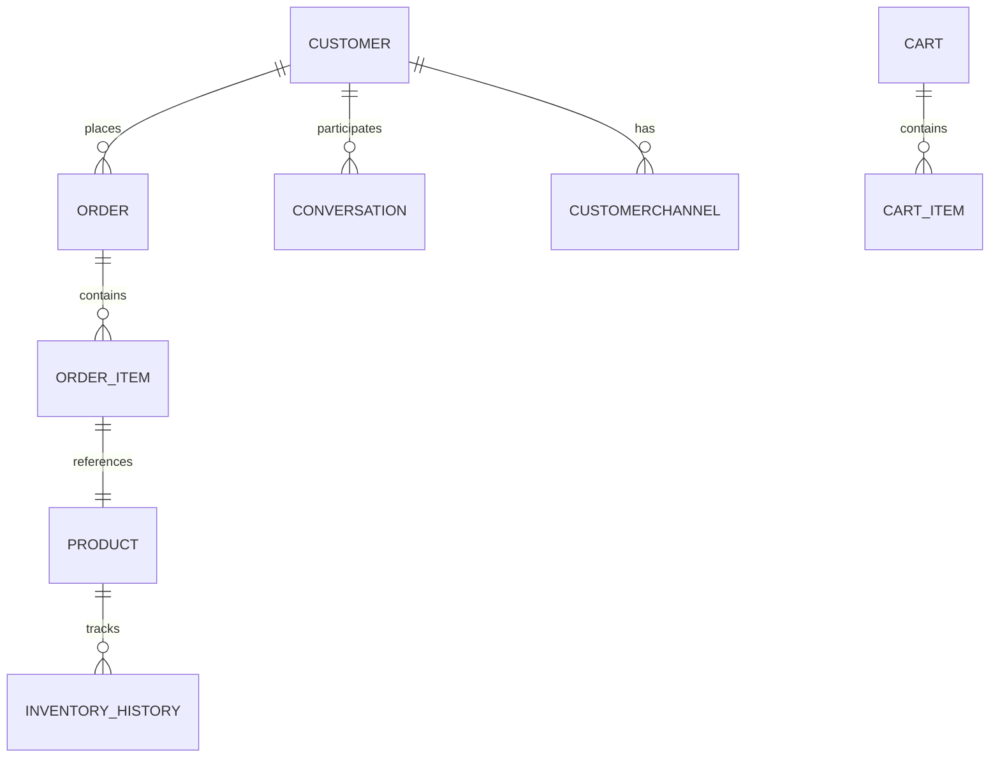

# Database Documentation — Fashion Hub AI Assistant

## 1. Overview

The Fashion Hub AI Assistant uses **MongoDB Atlas** as its cloud database with the database name **`fashionhub`**.

### Architecture

| Aspect | Detail |
|--------|--------|
| **Provider** | MongoDB Atlas (cloud-hosted) |
| **Database Name** | `fashionhub` |
| **AI Service Access** | Motor (async Python driver) — `ai-service` |
| **Backend Access** | Mongoose (Node.js ODM) — `backend/` |
| **Collections (AI Service)** | 6 main collections |
| **Collections (Backend)** | 6 main + 4 additional = 10 total |

### Connection Pooling (AI Service)

```python
AsyncIOMotorClient(
    settings.MONGO_URI,
    maxPoolSize=10,
    minPoolSize=1,
    serverSelectionTimeoutMS=5000,
    connectTimeoutMS=5000,
)
```

---

## 2. Collections

### 2.1 `products` — Inventory Catalog

**Purpose**: Stores all product inventory with pricing, variants, and metadata.

**Fields**:

| Field | Type | Description |
|-------|------|-------------|
| `_id` | ObjectId | Primary key |
| `productName` | String | Product display name (indexed) |
| `category` | String | Product category e.g. "Shirts", "Shoes" (indexed) |
| `subCategory` | String | Optional subcategory |
| `description` | String | Product description (part of text index) |
| `price` | Number | Base price (indexed) |
| `discount` | Number | Discount percentage (0–100) |
| `sizes` | Array[String] | Available sizes e.g. ["S", "M", "L"] |
| `colors` | Array[String] | Available colors (indexed) |
| `stock` | Number | Current stock quantity |
| `images` | Array[String] | Image URLs |
| `rating` | Number | Average rating (0–5) |
| `gender` | String | Target gender: Men, Women, Unisex, Boys, Girls (indexed) |
| `season` | String | Season: Spring, Summer, Autumn, Winter, All Season (indexed) |
| `isTrending` | Boolean | Trending flag (indexed) |
| `isBestSeller` | Boolean | Best seller flag (indexed) |
| `status` | Boolean | Product active/inactive |
| `createdAt` | Date | Auto-generated timestamp |
| `updatedAt` | Date | Auto-generated timestamp |

**Indexes**: `productName`, `category`, `gender`, `price`, compound text `(productName, category, description)`, `isBestSeller`, `isTrending`, `season`, `colors`

**Example Document**:
```json
{
  "_id": "ObjectId('664a1b2c3d4e5f6a7b8c9d0e')",
  "productName": "Summer Floral Dress",
  "category": "Dresses",
  "subCategory": "Casual",
  "description": "Lightweight floral print dress perfect for summer",
  "price": 2499,
  "discount": 15,
  "sizes": ["S", "M", "L", "XL"],
  "colors": ["Red", "Blue", "White"],
  "stock": 50,
  "images": ["/uploads/products/dress1.jpg", "/uploads/products/dress2.jpg"],
  "rating": 4.5,
  "gender": "Women",
  "season": "Summer",
  "isTrending": true,
  "isBestSeller": false,
  "status": true,
  "createdAt": "2024-05-18T10:30:00.000Z",
  "updatedAt": "2024-07-20T14:22:00.000Z"
}
```

---

### 2.2 `orders` — Customer Orders

**Purpose**: Stores complete order records with embedded product snapshots.

**Fields**:

| Field | Type | Description |
|-------|------|-------------|
| `_id` | ObjectId | Primary key |
| `orderId` | String | Unique order identifier e.g. "ORD-A3F8C921" (unique index) |
| `customer` | ObjectId | Reference to Customer (indexed) |
| `products` | Array[OrderItem] | Embedded order items (see below) |
| `subtotal` | Number | Sum of all item subtotals |
| `totalDiscount` | Number | Total discount amount |
| `deliveryCharges` | Number | Delivery fee |
| `grandTotal` | Number | Final total (subtotal + delivery - discount) |
| `paymentMethod` | String | Cash on Delivery, JazzCash, Easypaisa, Bank Transfer, Card |
| `paymentStatus` | String | Pending, Paid, Failed, Refunded |
| `status` | String | Pending, Confirmed, Processing, Shipped, Delivered, Cancelled (indexed) |
| `trackingNumber` | String | Courier tracking number |
| `shippingAddress` | String | Customer's shipping address |
| `city` | String | Customer's city for delivery calculation |
| `province` | String | Customer's province for delivery calculation |
| `notes` | String | Order notes |
| `createdAt` | Date | Auto-generated timestamp |
| `updatedAt` | Date | Auto-generated timestamp |

**Embedded OrderItem fields**:

| Field | Type | Description |
|-------|------|-------------|
| `product` | ObjectId | Reference to Product |
| `productName` | String | Product name at time of order (snapshot) |
| `quantity` | Number | Quantity ordered |
| `selectedSize` | String | Selected size variant |
| `selectedColor` | String | Selected color variant |
| `originalPrice` | Number | Price before discount |
| `discountPercentage` | Number | Discount applied (%) |
| `discountAmount` | Number | Calculated discount amount per unit |
| `finalPrice` | Number | Price after discount |
| `subtotal` | Number | `finalPrice * quantity` |

**Indexes**: `orderId` (unique), `customer`, `status`

**Example Document**:
```json
{
  "_id": "ObjectId('664b2c3d4e5f6a7b8c9d0e1f')",
  "orderId": "ORD-A3F8C921",
  "customer": "ObjectId('664a1b2c3d4e5f6a7b8c9d0a')",
  "products": [
    {
      "product": "ObjectId('664a1b2c3d4e5f6a7b8c9d0e')",
      "productName": "Summer Floral Dress",
      "quantity": 2,
      "selectedSize": "M",
      "selectedColor": "Red",
      "originalPrice": 2499,
      "discountPercentage": 15,
      "discountAmount": 374.85,
      "finalPrice": 2124.15,
      "subtotal": 4248.30
    }
  ],
  "subtotal": 4248.30,
  "totalDiscount": 749.70,
  "deliveryCharges": 150,
  "grandTotal": 4398.30,
  "paymentMethod": "Cash on Delivery",
  "paymentStatus": "Pending",
  "status": "Confirmed",
  "trackingNumber": "TRAK-123456",
  "shippingAddress": "House 12, Street 5, G-9/1",
  "city": "Islamabad",
  "province": "Islamabad Capital Territory",
  "notes": "Call before delivery",
  "createdAt": "2024-07-21T09:15:00.000Z",
  "updatedAt": "2024-07-21T09:15:00.000Z"
}
```

---

### 2.3 `customers` — Customer Profiles

**Purpose**: Stores customer profile data with preferences and order history references.

**Fields**:

| Field | Type | Description |
|-------|------|-------------|
| `_id` | ObjectId | Primary key |
| `name` | String | Customer name |
| `phoneNumber` | String | Phone number |
| `whatsappNumber` | String | WhatsApp number (indexed) |
| `instagramId` | String | Instagram username (indexed) |
| `email` | String | Email address |
| `password` | String | Hashed password (backend only, select: false) |
| `address` | String | Customer address |
| `city` | String | Customer city |
| `isVerified` | Boolean | Email/phone verification status |
| `isActive` | Boolean | Account active status |
| `lastLogin` | Date | Last login timestamp |
| `preferences` | Object | Nested preferences (see below) |
| `orderHistory` | Array[ObjectId] | References to Order documents |
| `createdAt` | Date | Auto-generated timestamp |
| `updatedAt` | Date | Auto-generated timestamp |

**Embedded `preferences` object**:

| Field | Type | Description |
|-------|------|-------------|
| `favoriteCategory` | String | Preferred product category |
| `favoriteColor` | String | Preferred color |
| `favoriteSize` | String | Preferred size |
| `budget` | Number | Budget limit |
| `gender` | String | Preferred gender category (Men, Women, Unisex) |

**Indexes**: `whatsappNumber`, `instagramId`

**Example Document**:
```json
{
  "_id": "ObjectId('664a1b2c3d4e5f6a7b8c9d0a')",
  "name": "Ayesha Khan",
  "phoneNumber": "+923001234567",
  "whatsappNumber": "+923001234567",
  "instagramId": "ayesha_style",
  "email": "ayesha@email.com",
  "address": "House 12, Street 5, G-9/1",
  "city": "Islamabad",
  "isVerified": true,
  "isActive": true,
  "lastLogin": "2024-07-20T18:30:00.000Z",
  "preferences": {
    "favoriteCategory": "Dresses",
    "favoriteColor": "Red",
    "favoriteSize": "M",
    "budget": 5000,
    "gender": "Women"
  },
  "orderHistory": [
    "ObjectId('664b2c3d4e5f6a7b8c9d0e1f')"
  ],
  "createdAt": "2024-05-10T12:00:00.000Z",
  "updatedAt": "2024-07-20T18:30:00.000Z"
}
```

---

### 2.4 `conversations` — Chat Conversation History

**Purpose**: Stores chat conversations between customers and the AI assistant.

**Fields**:

| Field | Type | Description |
|-------|------|-------------|
| `_id` | ObjectId | Primary key |
| `customer` | ObjectId | Reference to Customer (indexed) |
| `platform` | String | Instagram or WhatsApp (indexed) |
| `messages` | Array[Message] | Embedded message array (see below) |
| `lastMessage` | String | Text of the most recent message |
| `intent` | String | Current detected intent |
| `lastIntent` | String | Previous detected intent |
| `sentiment` | String | Detected sentiment: happy, interested, neutral, frustrated, angry |
| `isResolved` | Boolean | Whether conversation is resolved (indexed via query) |
| `createdAt` | Date | Auto-generated timestamp |
| `updatedAt` | Date | Auto-generated timestamp (indexed) |

**Embedded Message fields**:

| Field | Type | Description |
|-------|------|-------------|
| `sender` | String | Customer, AI, or Admin |
| `message` | String | Message text |
| `messageType` | String | Text, Image, Video, Document |
| `metadata` | Object | Optional metadata (intent, entities, productIds, orderId) |
| `timestamp` | Date | Message timestamp |

**Indexes**: `customer`, `platform`, `updatedAt`

**Example Document**:
```json
{
  "_id": "ObjectId('664c3d4e5f6a7b8c9d0e1f2a')",
  "customer": "ObjectId('664a1b2c3d4e5f6a7b8c9d0a')",
  "platform": "WhatsApp",
  "messages": [
    {
      "sender": "Customer",
      "message": "Hi, I'm looking for a summer dress",
      "messageType": "Text",
      "metadata": {},
      "timestamp": "2024-07-21T10:00:00.000Z"
    },
    {
      "sender": "AI",
      "message": "Hello! I'd be happy to help you find a summer dress. Do you have a preferred color or size?",
      "messageType": "Text",
      "metadata": {
        "intent": "product_inquiry",
        "entities": { "category": "Dresses", "season": "Summer" },
        "productIds": []
      },
      "timestamp": "2024-07-21T10:00:01.000Z"
    }
  ],
  "lastMessage": "Hello! I'd be happy to help you find a summer dress.",
  "intent": "product_inquiry",
  "lastIntent": "",
  "sentiment": "interested",
  "isResolved": false,
  "createdAt": "2024-07-21T10:00:00.000Z",
  "updatedAt": "2024-07-21T10:00:01.000Z"
}
```

---

### 2.5 `carts` — Shopping Cart Storage

**Purpose**: Stores temporary shopping cart data for logged-in and guest users.

**Fields**:

| Field | Type | Description |
|-------|------|-------------|
| `_id` | ObjectId | Primary key |
| `customer_id` | String | Customer ID (for logged-in users, indexed) |
| `session_id` | String | Session ID (for guest users, indexed) |
| `items` | Array[CartItem] | Embedded cart items |
| `createdAt` | Date | Auto-generated timestamp |
| `updatedAt` | Date | Auto-generated timestamp (indexed) |

**Embedded CartItem fields**: `productId`, `productName`, `quantity`, `selectedColor`, `selectedSize`, `price`, `discountPercentage`, `discountAmount`, `finalPrice`, `subtotal`

**Indexes**: `customer_id`, `session_id`, `updatedAt`

**Example Document**:
```json
{
  "_id": "ObjectId('664d4e5f6a7b8c9d0e1f2a3b')",
  "customer_id": "664a1b2c3d4e5f6a7b8c9d0a",
  "session_id": "session_abc123",
  "items": [
    {
      "productId": "664a1b2c3d4e5f6a7b8c9d0e",
      "productName": "Summer Floral Dress",
      "quantity": 1,
      "selectedColor": "Red",
      "selectedSize": "M",
      "price": 2499,
      "discountPercentage": 15,
      "discountAmount": 374.85,
      "finalPrice": 2124.15,
      "subtotal": 2124.15
    }
  ],
  "createdAt": "2024-07-21T11:00:00.000Z",
  "updatedAt": "2024-07-21T11:05:00.000Z"
}
```

---

### 2.6 `inventory_history` — Inventory Change Audit Trail

**Purpose**: Audit log for all stock changes (purchases and cancellations).

**Fields**:

| Field | Type | Description |
|-------|------|-------------|
| `_id` | ObjectId | Primary key |
| `orderId` | String | Associated order ID (indexed) |
| `productId` | String | Product ID (indexed) |
| `productName` | String | Product name for readability |
| `changeType` | String | `purchase` or `cancellation` |
| `quantityBefore` | Number | Stock before the change |
| `quantityAfter` | Number | Stock after the change |
| `delta` | Number | Negative for purchases, positive for cancellations |
| `createdAt` | Date | Auto-generated timestamp (indexed) |

**Indexes**: `orderId`, `productId`, `createdAt`

**Example Document**:
```json
{
  "_id": "ObjectId('664e5f6a7b8c9d0e1f2a3b4c')",
  "orderId": "ORD-A3F8C921",
  "productId": "664a1b2c3d4e5f6a7b8c9d0e",
  "productName": "Summer Floral Dress",
  "changeType": "purchase",
  "quantityBefore": 50,
  "quantityAfter": 48,
  "delta": -2,
  "createdAt": "2024-07-21T09:15:00.000Z"
}
```

---

### 2.7 `settings` — Store Configuration

**Purpose**: Singleton document storing all store configuration. Only one document exists.

**Fields** (18 total):

| Field | Type | Description |
|-------|------|-------------|
| `_id` | ObjectId | Primary key |
| `storeName` | String | Store display name |
| `storeCity` | String | Store base city (for delivery calc) |
| `storeProvince` | String | Store base province (for delivery calc) |
| `currency` | String | Currency code (default: PKR) |
| `supportEmail` | String | Customer support email |
| `supportPhone` | String | Customer support phone |
| `whatsappNumber` | String | Store WhatsApp number |
| `instagramUsername` | String | Store Instagram handle |
| `facebookPage` | String | Store Facebook page |
| `sameCityCharge` | Number | Delivery charge for same city (default: 150) |
| `sameProvinceCharge` | Number | Delivery charge for same province (default: 250) |
| `otherProvinceCharge` | Number | Delivery charge for other provinces (default: 350) |
| `freeDeliveryAbove` | Number | Free delivery threshold (default: 10000) |
| `sameDayDelivery` | Boolean | Same-day delivery availability |
| `deliveryTime` | String | Estimated delivery time |
| `returnPolicy` | String | Return policy text |
| `exchangePolicy` | String | Exchange policy text |
| `businessHours` | String | Store operating hours |
| `isStoreOpen` | Boolean | Whether store is currently open |
| `createdAt` | Date | Auto-generated timestamp |
| `updatedAt` | Date | Auto-generated timestamp |

**Example Document**:
```json
{
  "_id": "ObjectId('664f6a7b8c9d0e1f2a3b4c5d')",
  "storeName": "FashionHub",
  "storeCity": "Rawalpindi",
  "storeProvince": "Punjab",
  "currency": "PKR",
  "supportEmail": "support@fashionhub.com",
  "supportPhone": "+923001234567",
  "whatsappNumber": "+923001234567",
  "instagramUsername": "@fashionhub",
  "facebookPage": "facebook.com/fashionhub",
  "sameCityCharge": 150,
  "sameProvinceCharge": 250,
  "otherProvinceCharge": 350,
  "freeDeliveryAbove": 10000,
  "sameDayDelivery": false,
  "deliveryTime": "3-5 Working Days",
  "returnPolicy": "Returns accepted within 7 days.",
  "exchangePolicy": "Exchange available within 7 days.",
  "businessHours": "Monday - Saturday (9:00 AM - 8:00 PM)",
  "isStoreOpen": true,
  "createdAt": "2024-01-01T00:00:00.000Z",
  "updatedAt": "2024-07-01T12:00:00.000Z"
}
```

---

### 2.8 `customerchannels` — Platform Channel Mapping

**Purpose**: Maps a customer to their platform-specific user ID (WhatsApp number or Instagram ID).

**Fields**:

| Field | Type | Description |
|-------|------|-------------|
| `_id` | ObjectId | Primary key |
| `customerId` | ObjectId | Reference to Customer |
| `platform` | String | WhatsApp or Instagram |
| `platformUserId` | String | Platform-specific user identifier |
| `createdAt` | Date | Auto-generated timestamp |
| `updatedAt` | Date | Auto-generated timestamp |

**Example Document**:
```json
{
  "_id": "ObjectId('665a7b8c9d0e1f2a3b4c5d6e')",
  "customerId": "ObjectId('664a1b2c3d4e5f6a7b8c9d0a')",
  "platform": "WhatsApp",
  "platformUserId": "+923001234567",
  "createdAt": "2024-05-10T12:00:00.000Z",
  "updatedAt": "2024-05-10T12:00:00.000Z"
}
```

---

### Additional Backend Collections

#### 2.9 `admins` — Admin Authentication

**Purpose**: Stores admin user credentials and roles.

**Fields**: `fullName`, `email` (unique), `password` (hashed), `role` (Super Admin/Admin/Manager), `profileImage`, `phoneNumber`, `isActive`, `lastLogin`, `createdAt`, `updatedAt`

#### 2.10 `chatsessions` — WhatsApp Session State

**Purpose**: Stores step-by-step state for WhatsApp-based ordering flow.

**Fields**: `phoneNumber` (unique), `step`, `selectedProduct`, `quantity`, `size`, `color`, `customerName`, `address`, `city`, `province`, `orderId`, `orderCreated`, `createdAt`, `updatedAt`

#### 2.11 `aitrainings` — AI Training Data

**Purpose**: Stores Q&A pairs for AI training and custom responses.

**Fields**: `intent`, `category` (Greeting/Product/Price/Size/Color/Delivery/Order/etc.), `question`, `answer`, `keywords` (array), `language`, `isActive`, `createdAt`, `updatedAt`

---

## 3. Relationships



### Customer 1:N Order

A customer has many orders. The `orderHistory` array in `customers` stores `ObjectId` references to the `orders` collection. The `customer` field in `orders` stores a reference back to `customers`.

```json
// customers.orderHistory — array of Order ObjectId refs
"orderHistory": ["ObjectId('order1')", "ObjectId('order2')"]

// orders.customer — single Customer ObjectId ref
"customer": "ObjectId('customer1')"
```

### Order N:M Product

An order contains multiple products via the embedded `products` array. Each `orderItem.product` is an `ObjectId` referencing a `Product`. Product data is **snapshotted** at order time (productName, price, discount are copied into the item), so historical order data remains accurate even if the product changes.

### Customer 1:N Conversation

A customer has many conversations. The `customer` field in `conversations` stores an `ObjectId` reference to `customers`.

### Customer 1:N CustomerChannel

A customer can have multiple channel mappings (e.g., one WhatsApp entry and one Instagram entry). The `customerId` field in `customerchannels` references `customers`.

---

## 4. Indexes

### Complete Index Table

| Collection | Index Key(s) | Type | Unique |
|-----------|-------------|------|--------|
| **products** | `productName` | Single field | No |
| | `category` | Single field | No |
| | `gender` | Single field | No |
| | `price` | Single field | No |
| | `(productName, category, description)` | Compound text | No |
| | `isBestSeller` | Single field | No |
| | `isTrending` | Single field | No |
| | `season` | Single field | No |
| | `colors` | Single field | No |
| **orders** | `orderId` | Single field | **Yes** |
| | `customer` | Single field | No |
| | `status` | Single field | No |
| **conversations** | `customer` | Single field | No |
| | `platform` | Single field | No |
| | `updatedAt` | Single field | No |
| **customers** | `whatsappNumber` | Single field | No |
| | `instagramId` | Single field | No |
| **carts** | `customer_id` | Single field | No |
| | `session_id` | Single field | No |
| | `updatedAt` | Single field | No |
| **inventory_history** | `orderId` | Single field | No |
| | `productId` | Single field | No |
| | `createdAt` | Single field | No |

**Total: 23 indexes across 6 collections**

---

## 5. Transaction Patterns

All operations use MongoDB's atomic operators. There are **no multi-document ACID transactions** currently used in the codebase (the `create_order` method attempts a session+transaction but uses a loop with separate `$inc` calls).

### `$inc` — Atomic Stock Updates

Used for inventory changes without read-modify-write races:

```python
# Decrement stock on purchase
await collection.update_one(
    {"_id": ObjectId(product_id)},
    {"$inc": {"stock": -quantity}}
)

# Increment stock on cancellation
await collection.update_one(
    {"_id": ObjectId(product_id)},
    {"$inc": {"stock": quantity}}
)
```

### `$push` — Array Appends

```python
# Add message to conversation
await collection.update_one(
    {"_id": ObjectId(conversation_id)},
    {"$push": {"messages": message_data}}
)

# Add order to customer history
await collection.update_one(
    {"_id": ObjectId(customer_id)},
    {"$push": {"orderHistory": ObjectId(order_id)}}
)
```

### `$set` — Field Updates

```python
# Update order status
await collection.update_one(
    {"orderId": order_id},
    {"$set": {"status": "Cancelled"}}
)

# Update conversation analysis
await collection.update_one(
    {"_id": ObjectId(conversation_id)},
    {"$set": {"intent": intent, "sentiment": sentiment}}
)
```

### `$setOnInsert` — Conditional Creation

Used in cart upsert to set `createdAt` only on first insert:

```python
await collection.update_one(
    query,
    {
        "$set": {"items": items, "updatedAt": now},
        "$setOnInsert": {"createdAt": now}
    },
    upsert=True
)
```

### `find_one_and_update` — Atomic Read-Modify-Write

Not currently used in this codebase. The pattern used is `update_one()` followed by a separate `find_one()` call. This is not fully atomic but is acceptable for single-document operations.

### No Multi-Document ACID Transactions

The `create_order` flow starts a session and transaction, but the nested operations (`update_stock`, `add_order_history`) accept a `session` parameter. This means the code is **prepared for transactions** if the deployment switches to a replica set. Standalone MongoDB does not support transactions.

---

## 6. ER Diagram

```mermaid
erDiagram
    CUSTOMERS ||--o{ ORDERS : "places"
    CUSTOMERS ||--o{ CONVERSATIONS : "participates_in"
    CUSTOMERS ||--o{ CUSTOMERCHANNELS : "has_channel"
    CUSTOMERS ||--o{ CARTS : "owns"
    ORDERS ||--o{ ORDER_ITEMS : "contains"
    ORDER_ITEMS ||--|| PRODUCTS : "references"
    PRODUCTS ||--o{ INVENTORY_HISTORY : "tracks"
    PRODUCTS ||--o{ CARTS : "added_to"

    CUSTOMERS {
        ObjectId _id PK
        string name
        string phoneNumber
        string whatsappNumber
        string instagramId
        string email
        string address
        string city
        object preferences
        array orderHistory FK
        datetime createdAt
        datetime updatedAt
    }

    ORDERS {
        ObjectId _id PK
        string orderId UK
        ObjectId customer FK
        array products
        number subtotal
        number totalDiscount
        number deliveryCharges
        number grandTotal
        string paymentMethod
        string paymentStatus
        string status
        shippingAddress
        datetime createdAt
        datetime updatedAt
    }

    ORDER_ITEMS {
        ObjectId product FK
        string productName
        number quantity
        string selectedSize
        string selectedColor
        number finalPrice
        number subtotal
    }

    PRODUCTS {
        ObjectId _id PK
        string productName
        string category
        number price
        number discount
        array sizes
        array colors
        number stock
        string gender
        string season
        boolean isTrending
        boolean isBestSeller
        datetime createdAt
        datetime updatedAt
    }

    CONVERSATIONS {
        ObjectId _id PK
        ObjectId customer FK
        string platform
        array messages
        string lastMessage
        string intent
        string sentiment
        boolean isResolved
        datetime createdAt
        datetime updatedAt
    }

    CUSTOMERCHANNELS {
        ObjectId _id PK
        ObjectId customerId FK
        string platform
        string platformUserId
        datetime createdAt
        datetime updatedAt
    }

    CARTS {
        ObjectId _id PK
        string customer_id
        string session_id
        array items
        datetime createdAt
        datetime updatedAt
    }

    INVENTORY_HISTORY {
        ObjectId _id PK
        string orderId
        string productId
        string productName
        string changeType
        number quantityBefore
        number quantityAfter
        number delta
        datetime createdAt
    }

    SETTINGS {
        ObjectId _id PK
        string storeName
        string storeCity
        string storeProvince
        string currency
        number sameCityCharge
        number sameProvinceCharge
        number otherProvinceCharge
        number freeDeliveryAbove
        string deliveryTime
        string returnPolicy
        string exchangePolicy
        datetime createdAt
        datetime updatedAt
    }
```
