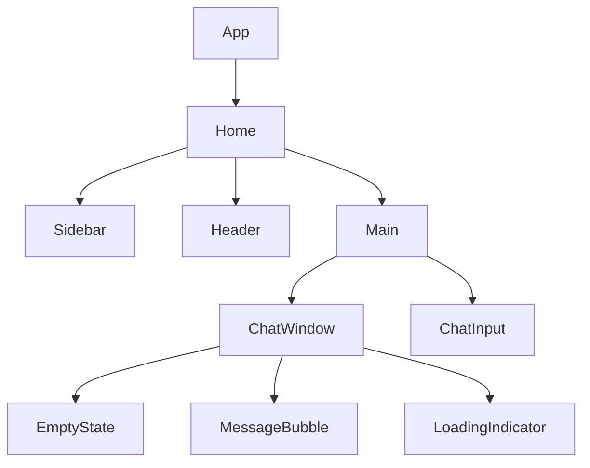

# Fashion Hub AI Assistant — Frontend Documentation

## 1. Overview

The frontend is a **React 19** single-page application built with **Vite 6** and styled with **Tailwind CSS v4**. It delivers a ChatGPT/Claude-inspired chat interface for the Fashion Hub AI Assistant, allowing users to interact with an AI stylist for product discovery, cart management, and order placement. AI responses are rendered as formatted Markdown.

| Technology | Version |
|-----------|---------|
| React | ^19.0.0 |
| Vite | ^6.1.0 |
| Tailwind CSS | ^4.0.6 |
| React Router | ^7.1.3 |

---

## 2. Component Tree



- **App** — Router wrapper with a single route `/` mapping to `Home`, plus a 404 catch-all that redirects to `/`.
- **Home** — Root layout: flex container with `Sidebar` on the left and `Header` + `Main` (containing `ChatWindow` + `ChatInput`) on the right.
- **ChatWindow** — Conditionally renders `EmptyState` (when no messages exist) or a list of `MessageBubble` components, followed by `LoadingIndicator` while awaiting a response.

---

## 3. Page Components

### Home.jsx (`src/pages/Home.jsx`)

The main layout page. Structure:

```
<div class="h-screen flex bg-gradient-to-br from-white via-gray-50/30 to-gray-100/40">
  <Sidebar />
  <div class="flex flex-col flex-1 min-w-0">
    <Header />
    <main class="flex-1 flex flex-col min-w-0">
      <ChatWindow />
      <ChatInput />
    </main>
  </div>
</div>
```

**Key behaviours:**
- Runs a **connection health check** on mount by sending a dummy request to `/api/chat`. Sets `connected` state based on success/failure.
- Manages `sidebarCollapsed` boolean state passed to `Sidebar` and its toggle callback.
- Sources `sessions`, `activeSessionId`, `messages`, `loading`, `sendMessage`, `switchSession`, `createNewSession`, and `deleteSession` from the `useChat` hook.

---

## 4. UI Components

### Header.jsx (`src/components/Header.jsx`)

A fixed-height status bar (3.5rem / `h-14`) with glass-morphism styling.

| Feature | Details |
|---------|---------|
| Left side | Gradient icon (indigo → purple) wrapping a `Bot` lucide icon; app title "Fashion Hub AI Assistant"; subtitle "Powered by Gemini 2.5 Flash" |
| Right side | Connection status badge with a coloured dot + label |
| Styling | `backdrop-blur-sm`, `bg-white/95`, bottom border |

**Status dot:** Green (`bg-emerald-500`) with a **ping animation** overlay when connected; red (`bg-red-400`) when disconnected. Badge background changes colour accordingly (`bg-emerald-50` / `bg-red-50`).

### Sidebar.jsx (`src/components/Sidebar.jsx`)

Collapsible side panel for session management.

| Feature | Details |
|---------|---------|
| New Chat button | Gradient background (`from-indigo-600 to-indigo-500`), `active:scale-[0.97]` press effect |
| Session items | Highlight active session with `bg-indigo-50/70` and an indigo ring; truncate long titles |
| Delete button | Visible on hover; triggers a **scale-out animation** over **250ms** (`scale-95 opacity-0`) before removing the session |
| Collapse/expand | Transition via `duration-300 ease-in-out`; collapsed width is `52px`, expanded is `16rem` |
| Mobile overlay | When sidebar is open on mobile, a fixed backdrop (`bg-black/15`) covers the screen; tapping it closes the sidebar |
| Empty state | Shows a `History` icon (28px) with "No chats yet" text |

**SidebarItem sub-component:** Manages local `deleting` state for the delete animation. Only shows the delete button on hover (opacity transition).

### ChatWindow.jsx (`src/components/ChatWindow.jsx`)

Scrollable message list with auto-scroll behaviour.

- **Auto-scroll:** A `useRef` sentinel `div` at the bottom is scrolled into view on every `messages` or `loading` change (`behavior: 'smooth'`).
- **Empty state:** When `messages.length === 0`, renders the `EmptyState` component with:
  - Sparkles icon in a gradient rounded box
  - Descriptive heading and subtext
  - **4 suggestion cards** with `MessageSquare` + `ArrowRight` icons and hover effects
- **Message list:** Renders each message as a `MessageBubble`, then `LoadingIndicator` if `loading` is true.
- **Container:** `max-w-3xl` for optimal reading width, responsive padding.

### ChatInput.jsx (`src/components/ChatInput.jsx`)

Message composition input with auto-resizing textarea.

| Feature | Details |
|---------|---------|
| Textarea | Auto-resizes via `scrollHeight` calculation; **max height 160px** (`Math.min(el.scrollHeight, 160)`) |
| Enter to send | `handleKeyDown` intercepts Enter without Shift |
| Shift+Enter | Inserts a newline (native behaviour) |
| Focus ring | `focus-within:border-indigo-400 focus-within:ring-2 focus-within:ring-indigo-100/60` |
| Send button | Indigo gradient when active; `active:scale-95` press animation; disabled state uses `bg-gray-100 text-gray-300` |
| Sparkles icon | Decorative `Sparkles` icon shown inside the input border when empty |
| Disabled state | Entire input area gets `opacity-50`, `cursor-not-allowed` while loading |
| Auto-focus | `useEffect` re-focuses the textarea when loading completes |

### MessageBubble.jsx (`src/components/MessageBubble.jsx`)

Individual chat message with role-based styling.

| Aspect | User | AI |
|--------|------|----|
| Avatar | Indigo gradient with `User` icon | Gray gradient with `Bot` icon |
| Bubble | `bg-indigo-600 text-white`, `rounded-br-sm` | `bg-white text-gray-700`, `border`, `rounded-bl-sm` |
| Content | Plain text (`whitespace-pre-wrap`) | Markdown via `react-markdown` with `prose` styling |
| Alignment | Right-aligned (`flex-row-reverse`) | Left-aligned |

**Metadata** (AI messages only):
- **Sentiment badge** — colour-coded: `happy` (emerald), `interested` (blue), `frustrated` (amber), `angry` (red). Neutral sentiment is hidden.
- **Intent badge** — violet (`bg-violet-50 text-violet-600`).
- **Timestamp** — formatted with `toLocaleTimeString` (HH:MM).

**Animation:** `animate-fade-in-up` entrance animation (0.35s ease-out).

### LoadingIndicator.jsx (`src/components/LoadingIndicator.jsx`)

Three animated dots with staggered delays.

```css
.dot-1 { animation: pulse-dot 1.4s ease-in-out infinite; }
.dot-2 { animation: pulse-dot 1.4s ease-in-out infinite; animation-delay: 0.2s; }
.dot-3 { animation: pulse-dot 1.4s ease-in-out infinite; animation-delay: 0.4s; }
```

- Dots: 8px (`w-2 h-2`), `bg-indigo-400`, rounded-full
- Label: "Thinking..." in `text-xs text-gray-400`
- Container: `animate-fade-in`, indented to align with message bubbles (`pl-14`)

---

## 5. Custom Hooks

### useChat.js (`src/hooks/useChat.js`)

In-memory session and message state management hook.

**State:**
| State | Type | Description |
|-------|------|-------------|
| `sessions` | `Array<{id, messages[], title}>` | All chat sessions |
| `activeSessionId` | `string` | Currently selected session ID |
| `loading` | `boolean` | Whether an API call is in-flight |
| `error` | `string \| null` | Last error message |
| `messages` | derived | Messages from active session |

**Session IDs:** Auto-incrementing via a module-level `globalSessionCounter` counter, converted to string.

**Key functions:**

| Function | Description |
|----------|-------------|
| `sendMessage(text)` | Appends user message, calls API, appends AI response. On error, appends an error bubble with `[Error]` prefix. |
| `switchSession(id)` | Switches `activeSessionId`, clears error state. |
| `createNewSession()` | Generates a new ID, appends to sessions array, sets as active. |
| `deleteSession(id)` | Removes session; if none remain, creates a fresh session. Handles edge case where the deleted session was active. |
| `clearSession()` | Resets active session's messages and title to "New Chat". |

**Title auto-generation:** When the first message is sent in a session, the title is set to the first 40 characters of that message (with ellipsis if truncated).

**Error handling:** Catches API errors, extracts detail from `err.response?.data?.detail?.[0]?.msg`, and appends an assistant-role error bubble.

**History formatting:** Maps `messages` to `{role, content}` objects for inclusion in the API request body.

---

## 6. API Layer

### api.js (`src/services/api.js`)

Axios-based API client.

```js
const client = axios.create({
  baseURL: '/api',
  headers: { 'Content-Type': 'application/json' },
  timeout: 30000,
})
```

| Function | Endpoint | Payload |
|----------|----------|---------|
| `sendChatMessage({ session_id, message, customer_id, platform, history })` | `POST /api/chat` | `{ session_id, message, customer_id, platform, history }` |

### vite.config.js (`frontend/vite.config.js`)

```js
export default defineConfig({
  plugins: [react(), tailwindcss()],
  server: {
    port: 5173,
    proxy: {
      '/api': {
        target: 'http://127.0.0.1:8000',
        changeOrigin: true,
        rewrite: (path) => path.replace(/^\/api/, ''),
      },
    },
  },
})
```

All `/api` requests are proxied to `http://127.0.0.1:8000` during development, with the `/api` prefix stripped before forwarding.

---

## 7. Styling and Animations

### Tailwind CSS v4 Configuration (`src/index.css`)

```css
@import "tailwindcss";

@theme {
  --color-soft: #fafafa;
  --color-chat-bg: #f5f5f5;
}
```

### Custom Keyframes

| Keyframe | Purpose |
|----------|---------|
| `fade-in-up` | Entrance animation (0 → 1 opacity, 10px → 0 translateY) |
| `fade-in` | Simple opacity transition (0 → 1) |
| `pulse-dot` | Loading dot bounce (scale 0.6 → 1, opacity 0.3 → 1) |

### Animation Utility Classes

| Class | Animation |
|-------|-----------|
| `.animate-fade-in-up` | `fade-in-up 0.35s ease-out forwards` |
| `.animate-fade-in` | `fade-in 0.25s ease-out forwards` |
| `.animate-pulse-dot` | `pulse-dot 1.4s ease-in-out infinite` |
| `.animation-delay-200` | `animation-delay: 0.2s` |
| `.animation-delay-400` | `animation-delay: 0.4s` |

### Scrollbar Styling

Custom thin scrollbar (5px width) with transparent track and gray thumb (`#d4d4d4`), darkening on hover (`#a3a3a3`).

### Prose Class Overrides

Custom `--tw-prose-*` CSS variables for Markdown rendering inside `.prose` containers:
- Body text: `#374151`
- Links: `#4f46e5` (indigo), underline on hover
- Code: `#7c3aed`, `0.85em` font size with light gray background
- Code blocks: `#1f2937` background, 10px border radius
- Reduced margins on paragraphs, lists, and list items

### Selection Styling

```css
::selection {
  background-color: #c7d2fe;
  color: #1e1b4b;
}
```

---

## 8. State Management

The application uses **in-memory session state** via the `useChat` custom hook. There is **no global state library** (Redux, Zustand, etc.).

- **`useState`** — manages `sessions` array, `activeSessionId`, `loading`, and `error`.
- **`useCallback`** — wraps all mutating functions (`sendMessage`, `switchSession`, `createNewSession`, `deleteSession`, `clearSession`) to preserve referential stability.
- **`useRef`** — holds an AbortController reference (`abortRef`) for future cancellation support.

The `sessions` array is the single source of truth; `messages` is derived as `activeSession.messages`.

---

## 9. Routing

Implemented with `react-router-dom` v7.

```
BrowserRouter
  └─ Routes
       ├─ Route path="/"  →  <Home />
       └─ Route path="*"  →  <Navigate to="/" replace />
```

- Single route: `/` renders the `Home` page.
- **404 catch-all:** Any unmatched path redirects to `/` with `replace` (no history entry).

---

## 10. Responsive Design

| Aspect | Implementation |
|--------|---------------|
| Sidebar | **Desktop:** side panel with collapsible width transition. **Mobile:** overlay panel with semi-transparent backdrop (`bg-black/15`); tapping backdrop closes sidebar. |
| Breakpoints | `md:` prefix used for responsive padding and sidebar behaviour. At `md:` and above, the mobile backdrop is hidden (`md:bg-transparent md:static`). |
| Reading width | `max-w-3xl` (768px) on `ChatWindow` and `ChatInput` containers. |
| Padding | `px-4` on mobile, `md:px-6` on desktop (`Header`, `ChatWindow`). |
| Touch targets | All interactive elements have adequate sizing for touch interaction. |

---

## 11. Message Flow

```
User presses Enter
       │
       ▼
┌─────────────────────────────┐
│ 1. Append user message      │  ← { role: "user", content: text }
│    to session messages       │
└──────────┬──────────────────┘
           │
           ▼
┌─────────────────────────────┐
│ 2. Set loading = true       │  ← LoadingIndicator appears
└──────────┬──────────────────┘
           │
           ▼
┌─────────────────────────────┐
│ 3. Build history array      │  ← map messages → {role, content}[]
│    from current messages    │
└──────────┬──────────────────┘
           │
           ▼
┌─────────────────────────────┐
│ 4. POST /api/chat           │
│    { session_id, message,   │
│      customer_id, platform, │
│      history }              │
└──────────┬──────────────────┘
           │
     ┌─────┴─────┐
     │           │
     ▼           ▼
   Success     Error
     │           │
     ▼           ▼
┌─────────┐ ┌──────────┐
│ Parse   │ │ Extract  │
│ reply,  │ │ error    │
│ intent, │ │ message  │
│ sentiment│ │          │
└────┬────┘ └────┬─────┘
     │           │
     ▼           ▼
┌─────────────────────────┐
│ 5. Append AI message    │  ← { role: "assistant",
│    to session messages  │      content, intent, sentiment }
└──────────┬──────────────┘
           │
           ▼
┌─────────────────────────────┐
│ 6. Set loading = false      │  ← LoadingIndicator removed
└─────────────────────────────┘
```

- **Error path:** On catch, an error message is extracted from `err.response?.data?.detail?.[0]?.msg` or `err.message`, then appended as an assistant bubble with `[Error]` prefix.
- **Edge cases:** Empty message guard (`!text.trim()`), loading guard (prevents concurrent sends), session ID is captured at call time to avoid race conditions.

---

## 12. Dependencies

| Package | Version | Description |
|---------|---------|-------------|
| `react` | ^19.0.0 | Core UI library |
| `react-dom` | ^19.0.0 | React DOM renderer |
| `react-router-dom` | ^7.1.3 | Client-side routing (BrowserRouter, Routes, Navigate) |
| `react-markdown` | ^9.0.3 | Markdown-to-React rendering for AI responses |
| `lucide-react` | ^0.468.0 | Icon library (Bot, User, Send, Plus, Trash2, etc.) |
| `axios` | ^1.7.9 | HTTP client for API requests |
| `vite` | ^6.1.0 | Build tool and dev server |
| `@vitejs/plugin-react` | ^4.3.4 | Vite plugin for React Fast Refresh |
| `tailwindcss` | ^4.0.6 | Utility-first CSS framework |
| `@tailwindcss/vite` | ^4.0.6 | Vite plugin for Tailwind CSS v4 |
